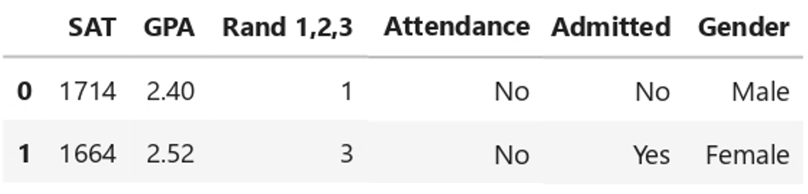
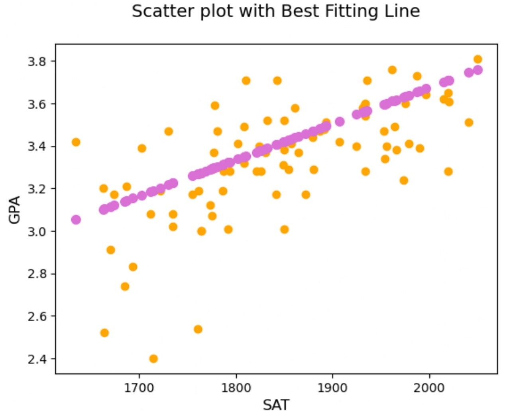
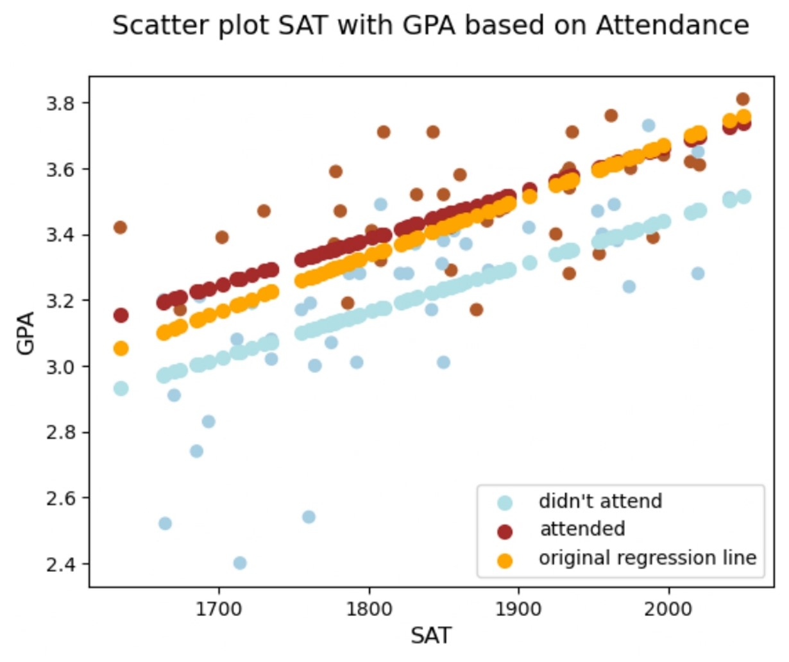
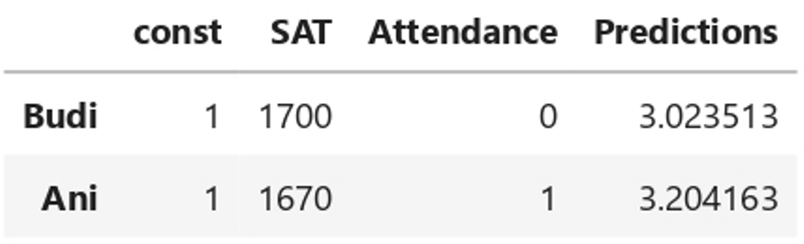
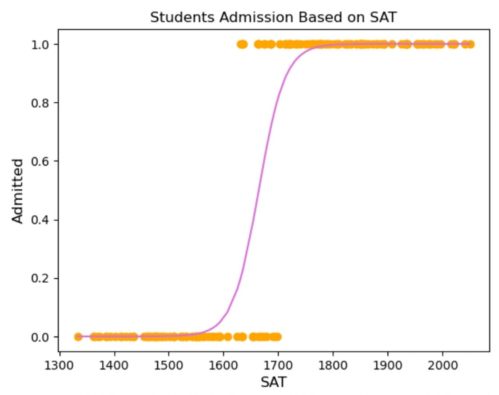
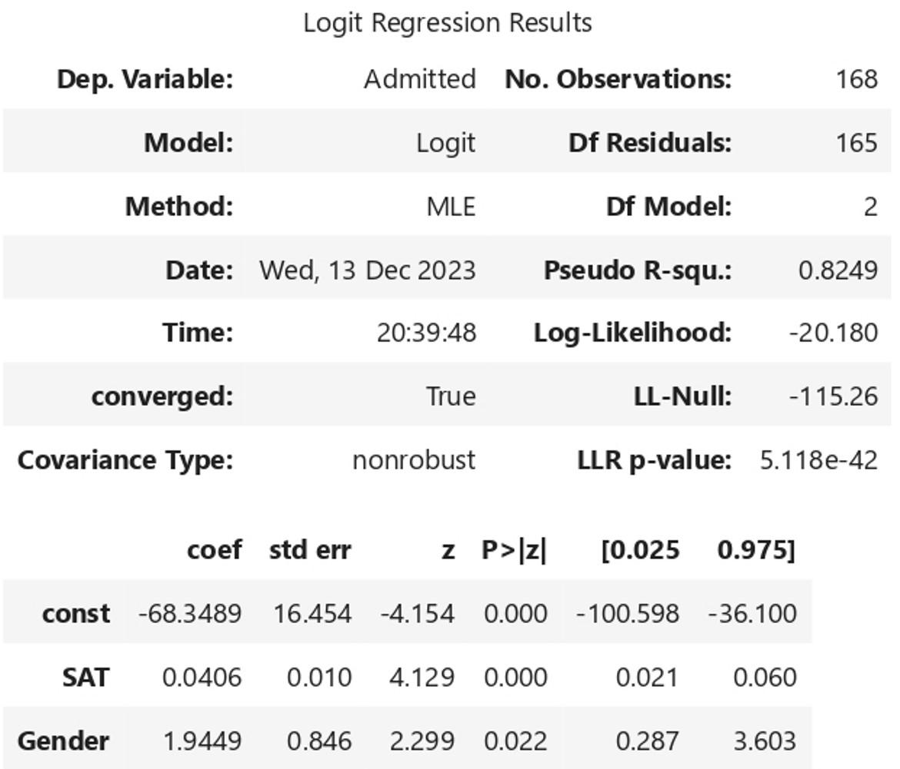
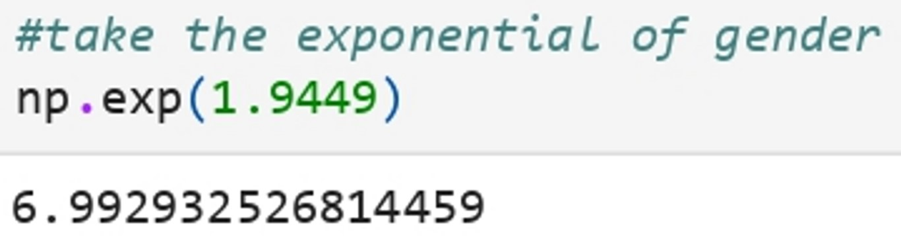
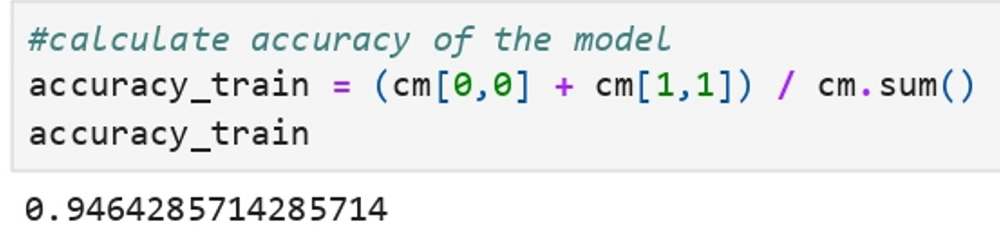

# Machine Learning Project Using Linear & Logistic Regression to Predict GPA from SAT Scores

## Project Description

**Problem :**  
Understanding the relationship between standardized test scores and academic performance is essential for educational institutions to make informed admission decisions. By leveraging historical data, the goal is to create a tool that assists admission offices in evaluating the potential academic success of applicants and provides valuable insights into the predictive power of SAT scores.

**Challenges :**  
Build a machine learning model that can predict GPA from SAT Scores

## Project Goal

This project aims to develop a predictive model that can estimate a student's GPA based on their SAT scores.

## Tools & Library Used

 &nbsp;
 &nbsp;

## Project Result

[Click here to get full code](https://github.com/nickenshidqia/Predict_GPA_From_SAT_Score_Using_Linear_Regression/blob/74f423e3073470eee6465db06c9d6559230dd5b1/GPA%20%26%20SAT.ipynb)

### Dataset

- There are 84 students who have studied in college
- SAT Score = Critical reading + Mathematics + Writing
- GPA = Grade Point Average (at graduation from university)

### Linear Regression

#### GPA based on SAT Score

  
  
- That is the best fitting line, or the line which is closest to all observation simultaneously
- Example if there is student who has SAT score 1700, then he will got GPA 3.165
- There is strong relationship between SAT and GPA
- The higher the SAT of a student, the higher their GPA

#### GPA based on SAT & Attendance

- From this dataset, we found that average of students attendance more than 75% of lectures is only 46.42% have attended. Mean < 0.5 shows that there are more 0s than 1s.
- On average the GPA of those who attendeded is higher than the one didn't attend the class.

#### Making Predictions

**Prediction 1**  
Create prediction of 2 students, whose the one that get higher GPA :

- Budi, who got 1700 on SAT and did not attend >75% of lecturers
- Ani, who got 1670 on SAT and attended >75% of lecturers

- The predicted GPA at graduation for Budi is 3.02
- The predicted GPA at graduation for Ani is 3.20
- Ani scored lower on SAT, but she attended > 75% of lectures, and she is predicted to graduate with a significantly higher GPA than Budi.

**Prediction 2**  
Create prediction of GPA for SAT score 1740 and 1760 :  

- The predicted GPA for SAT score 1740 = 3.155938
- The predicted GPA for SAT score 1760 = 3.189051
- The higher SAT score, the higher GPA score

### Logistic Regression

#### Predicting whether student will be admitted or not

- This function shows the probability of admission given an SAT score
- When SAT score is relatively low, the probability of getting admitted is 0%
- When SAT score is relatively high, the probability of getting admitted is 100%
- Score between 1,600 and 1,750 is uncertain
- SAT score 1,650, the students roughly 50% chance of getting in
- SAT score 1,700, the students got 80% chance of getting in

#### Predicting which gender will be the most admitted

  

- odds of female to get admitted are 6.99 times odds of male
- given the same SAT score, a female has 7 times higher odds to get admitted than the male
- in this particular university (degree), it is much easier for females to enter
- example communications, most of them are female, while STEM predominantly male

### Accuracy

- The accuracy of our model is 94.64%. Our model seems good at classifying
